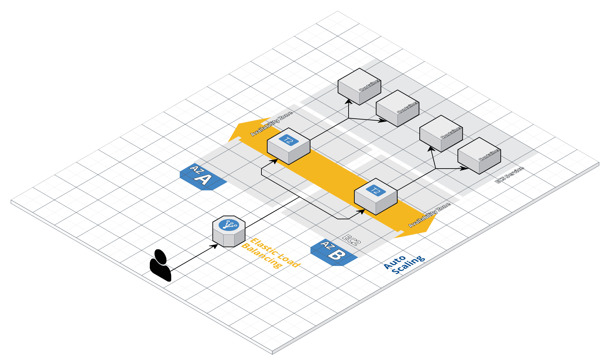

# Architecture

In the following steps, we will be building an architecture similar to the one below:



## AWS – Prerequisites

1. Set up your own personal AWS account and login.

2. Clone this repo, we will be running the commands from inside this folder. We need to build an image of our application that we can run on AWS. We can do so by running the following command from the `aws-workshop` project directory:

    `docker build -t outyet-image .`

3. Create a new IAM user https://console.aws.amazon.com/iam/home#/users
-> `Add User`

    IAM is a service that handles access to the AWS account. We will need a new user with API access to run the commands in the rest of the workshop. 
    
    `User Name` - `administrator`

    `Access type` - `Programmatic access`

    `Permissions` - `Attach existing policies directly`, select the checkbox for `AdministratorAccess`. Keep hitting 'Next' until you've created the user. After clicking 'Create User', stay on this page.

    We can now use the generated `Access key ID` and `Secret access key` to setup our `aws-vault` credentials.

4. Connect to aws-vault
https://github.com/99designs/aws-vault

`aws-vault` is a tool that securely stores and accesses the previously generated access key and secret for us, so we don't need to keep typing them in. It creates temporary sessions for us whenever we run a command to ensure our AWS access is as secure as possible. 

Install `aws-vault` using the instructions [here](https://github.com/99designs/aws-vault#installing) (if you haven't already at 99designs, check by running `aws-vault` on the command line), then configure your AWS vault to add a new profile (using the details from the IAM user that we created earlier):

```bash
$ aws-vault add aws-workshop
Enter Access Key Id: ABDCDEFDASDASF
Enter Secret Key: %%%
```

In your terminal, configure a region by adding
`profile=us-east-1` under the newly added profile in
`~/.aws/config`, otherwise you will have to keep specifying a region at each command.

```bash
[profile aws-workshop]
region=us-east-1
```

Now we can preface all commands in the workshop with `aws-vault exec aws-workshop -- `, which will create new credentials for us (if required), and use these in any AWS CLI commands we run. 

Note that a default VPC is created when you create a free account, you can check like this:

`aws-vault exec aws-workshop -- aws ec2 describe-vpcs`

to confirm whether your AWS vault credentials are setup correctly. 
## Host Docker image on ECR

We use Amazon ECR (Elastic Container Repository) to host our application images, which AWS can pull from to run our application in later steps. 
1. Create a new ECR repository, named `outyet-image`, via AWS Console

https://console.aws.amazon.com/ecr/create-repository?region=us-east-1

Keep the visibility `private` and the rest of the options default, then click `Create repository`

2. Get creds for repo so you can push image

Note: you will need to replace the URI with the one from your account. It is available from the table at https://console.aws.amazon.com/ecr/repositories

`aws-vault exec aws-workshop -- aws ecr get-login-password --region us-east-1 | docker login --username AWS --password-stdin 424795685451.dkr.ecr.us-east-1.amazonaws.com/outyet-image`

You should see a `Login succeeded` message to indicate you will be able to push your image.

3. Tag the image (built in the last step)
`docker tag outyet-image:latest 424795685451.dkr.ecr.us-east-1.amazonaws.com/outyet-image:latest`. Tagging allows us to have multiple 'versions' of our image hosted in ECR, which is useful if we ever want to deploy a newer version with code changes etc.

4. Push the image to ECR
`docker push 424795685451.dkr.ecr.us-east-1.amazonaws.com/outyet-image:latest`

Once the push is complete, you should be able to see the image in the ECR Console (by clicking on the `outyet-image` repository). We are now ready to run this image and get our application running in AWS!
## Creating a new ECS Cluster

ECS is an AWS managed service to deploy, manage and run Docker containers. We will use this service to create a scalable cluster to run our application, and which will automatically scale up and down the infrastructure to meet any traffic needs.  

### Before we can create the cluster
There are a few things we need to setup before creating the cluster, as AWS does not allow us to edit them once the cluster is created.

#### Create a new keypair
We will need a `keypair` (SSH keys), in case something goes wrong with our cluster and we need to debug why our application isn't running correctly. Head to the [AWS Key pairs Console page](https://us-east-1.console.aws.amazon.com/ec2/v2/home?region=us-east-1#KeyPairs:), and click `Create key pair`. Name it `outyet` and create it, which should download an `outyet.pem` file which we will need later should we need to debug anything.
#### Preparing a security group
Before we create a new `Cluster` in ECS, we need to make a security group that can be applied to it. Security groups are virtual firewalls that can either block or allow traffic to many AWS resources based on a port and IP address. By default, most AWS resources are 'closed' to everything, and need to have a security group applied that will open up access. 

1. Head to the [`Security Groups` Console page](https://console.aws.amazon.com/ec2/v2/home?region=us-east-1#SecurityGroups:), and create a new `Security group` named `outyet-sg`, with any description you like. 

Leave the rest of the sections empty for now, we will come back and later and open up the ports once we have some more information about our cluster.
### Creating a new cluster
We are going to create a new cluster of containers that are hosted on EC2 instances. These instances can run many containers at once, depending on their size. 

1. Navigate to the [ECS section of the AWS console](https://console.aws.amazon.com/ecs/home?region=us-east-1#/clusters) and create a new cluster.
2. Choose `EC2 Linux + Networking` for the cluster template
3. Name the cluster `outyet-cluster`

Leave most things default but..

- Change `EC2 Instance type` to `t2.nano`. This is the smallest size possible
- Change `Number of instances` to 2
- For `Key pair`, select the `outyet` pair which we created earlier. 
- Use the default VPC (not `Create a new VPC`), and select all subnets
- For `Security group`, select our previously created `outyet-sg` group. This will mean any changes we make to that group will be applied to our cluster automatically later on. 

Click `Create`. This will create all the resources we require to run our containers on ECS, including our 2 EC2 instances which should appear after a few minutes after you refresh the page. We can now take a look at how we can run our application!
## Run your docker container on EC2

Create a task definition, a blueprint to _start_ the container. Task definitions specify the container information for your application, such as what CPU and memory resources they will use, how they are linked together, and which host ports they will use.

Note: you will need to update the `image` definition in the `task-definition.json` file to match the location of your ECR repository for this step to work correctlly.

```
cd ops
aws-vault exec aws-workshop -- aws ecs register-task-definition --cli-input-json file://task-definition.json
```

This will create a new Task Definition, which is what ECS uses to 'run' a particular container. Each time you register a task definition for a particular task name, it will create a new task 'number' for us. We have just created version 1 of our `outyet-task`, which you can see [here](https://console.aws.amazon.com/ecs/home?region=us-east-1#/taskDefinitions/outyet-task/1). 
## Load balancer and a target group

For our application to be truly scalable, we need something that sits in front of our containers to handle ALL of our requests, and route them to containers that have the least load on them. AWS provides a service called 'Application Load Balancers' which does just that. It also ensures that all our containers are healthy by running periodic 'health checks' against them, which the containers have to pass for traffic to be routed their way. 

Create an ALB via the AWS Console: https://console.aws.amazon.com/ec2/v2/home?region=us-east-1#LoadBalancers:sort=loadBalancerName

- Select application load balancer, name it `outyet-alb`, leave everything else the same, ensuring you have your default VPC setup.
- Select all available `Availablility zones`. These are separate physical locations that Amazon runs their infrastructure on, which ensures that if there is an issue with one, our application can still be run in any of the other datacentres. AWS handles this transparently for us. 
- Skip the warning about SSL, this is just a test app
- Create a new Security group named `outyet-alb-sg`; open up port 80 and source 0.0.0.0/0 so anything from the outside world can access the ALB on port 80 (HTTP). To do so, ensure `Port Range` is `80`, and the Source is `Custom` with a value of `0.0.0.0/0, ::/0`. This means our load balancer will accept traffic on port 80 from anywhere. 
- Create a new target group named outyet-alb-target-group with port 80. The ALB will forward any requests to our instances in this target group on the specified port. 
- Register instances to your target group (registers instances to the load balancer). These instances were created for us automatically during the `Cluster` setup.

Right now, our EC2 instances (using security group `outyet-sg`) which we just registered will not accept any connections from the load balancer as they are assigned the very first security group which we created which didn't have any 'allow' rules applied. This means that traffic from the load balancer cannot even reach our insances where we will be running our containers. We can use the following command to rectify this:

`aws-vault exec aws-workshop -- aws ec2 authorize-security-group-ingress --group-name outyet-sg --protocol tcp --port 1-65535 --source-group outyet-alb-sg`

The above command means `For any resource that has the outyet-sg security group applied, allow access on all ports to any resources that have the outyet-alb-sg security group applied`. Because our EC2 instances have the `outyet-sg` security group applied, and our load balancer has the `outyet-alb-sg` group, this means requests that come to our load balancer can now be passed onto our instances, ready for our application to handle!

Note: The above command can also be replicated through 'click-ops' in the AWS console by editing the security group directly. You can view that it has applied correctly by viewing the security group in the AWS console. 

## Create a service that runs our task
A service defines how we want to run our task definition, including how many containers we wish to run, and how we want to register these containers with our load balancer/target group. This is where we tie everything together and get to see our application running :tada:

Jump into the `ecs-service.json` Cloudformation template to get started. Use the ARN (resource name) of your new load balancer's target group in this template for the target group (you can get this by going to the [`Target Groups` AWS Console page](https://console.aws.amazon.com/ec2/v2/home?region=us-east-1#TargetGroups:)). You will also need to update the `role` value to the ARN for the ECS role in your account from [here](https://console.aws.amazon.com/iam/home#/roles/AWSServiceRoleForECS).

`aws-vault exec aws-workshop -- aws ecs create-service --cli-input-json file://ecs-service.json`

What have we done here? Let's find out! Head back to our [ECS `outyet-cluster` page](https://console.aws.amazon.com/ecs/home?region=us-east-1#/clusters/outyet-cluster/services) and see what's changed:

- We have a new `outyet-service` service running. A service is responsible for running our containers with the configuration we set out in our task definition. It is also responsible for ensuring that our containers are 'healthy' and receiving traffic properly: if they are not, they will be 'stopped' and another container will be started in it's place.
- Click on the service name to view the [service](https://console.aws.amazon.com/ecs/home?region=us-east-1#/clusters/outyet-cluster/services/outyet-service/details) in more detail. Click the `Tasks` tab, and you should see that we are running 3 'tasks' (containers'), based on our `ouyet-task:1` task definition file. We are running 3 containers because that is what we defined when we created our service (with the `ecs-service.json` file), and defined it as our 'desired' count. 

Now that we have created all the infrastructure, let's check that our app is running correctly! Find the DNS name associated with our load balancer from the [load balancers page](https://console.aws.amazon.com/ec2/v2/home?region=us-east-1#LoadBalancers:sort=loadBalancerName), by clicking the load balancer and viewing the details in the bottom pane. Paste it into your web browser to see our beautiful application!
##  Exercises
* Stop an individual task and see what happens - why? Hint: take a look at the `Events` tab for our service. 
* If we have very heavy traffic load and want to run some more containers, what do we need to change? Give it a go and see what happens. 
* If we need to release a new version of our application, which resources need to be changed and updated? Why?
* How can we ensure on a new deploy that there is no downtime for our application?
* We are now running some of our services on `Fargate`, as opposed to EC2. Which parts of our infrastructure do we not need when running on `Fargate`?
* Teardown! Remove all traces - try to remember what we created. What order does it need to be removed in? (Important, aws may charge $$)
